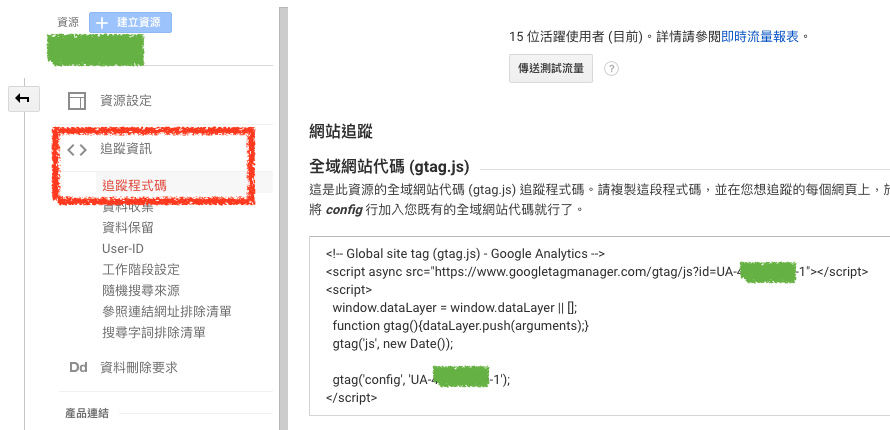

# 安裝程式碼

在 `管理` / `資源` / `追蹤資訊` / `追蹤程式碼` 中可以找到安裝 GA 的相關程式碼



## 使用 `gtag()` 安裝程式碼

```html
<!-- Global site tag (gtag.js) - Google Analytics -->
<script async src="https://www.googletagmanager.com/gtag/js?id=UA-XXXXXXXX-1"></script>
<script>
  window.dataLayer = window.dataLayer || [];
  function gtag(){dataLayer.push(arguments);}
  gtag('js', new Date());

  gtag('config', 'UA-XXXXXXXX-1');
</script>
```


## `gtag()` 代碼前置碼類型

| 前置碼  | 說明  |
|---|---|
| UA  | 您的全域網站代碼是由 Google Analytics (分析) 控制。此 ID 即為您的 Google Analytics (分析) 評估 ID。如要尋找與此 ID 相關聯的資源，請使用 Google Analytics (分析) 中的帳戶搜尋功能。如果搜尋結果未顯示相關資源，代表您可能沒有存取權。  |
| G  | 您的全域網站代碼是由 Google Analytics (分析) 應用程式 + 網站串流控制。此 ID 即為您的 Google Analytics (分析) 評估 ID。  |
| AW  | 您的全域網站代碼是由 Google Ads 控制。AW 前置碼後方的數值字串即為您的 Google Ads 轉換 ID。  |
| DC  | 您的全域網站代碼是由 Floodlight 代碼控制。DC 後方的數值字串即為您的廣告客戶 ID。  |
| 其他  |  您的全域網站代碼是由其他 Google 產品控制，或可能未正確導入。請使用 Google Chrome 專用的 Tag Assistant 擴充功能進行驗證。 |


## 參考資料
* [設定 Analytics (分析) 代碼 - Analytics (分析)說明](https://support.google.com/analytics/answer/1008080)
* [設定 Analytics (分析) 代碼 - Analytics (分析)說明](https://support.google.com/analytics/answer/9310895?hl=zh-Hant)
