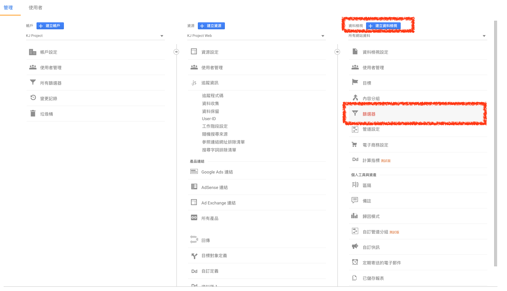
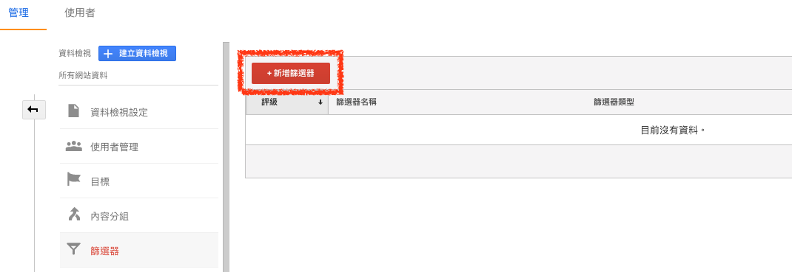
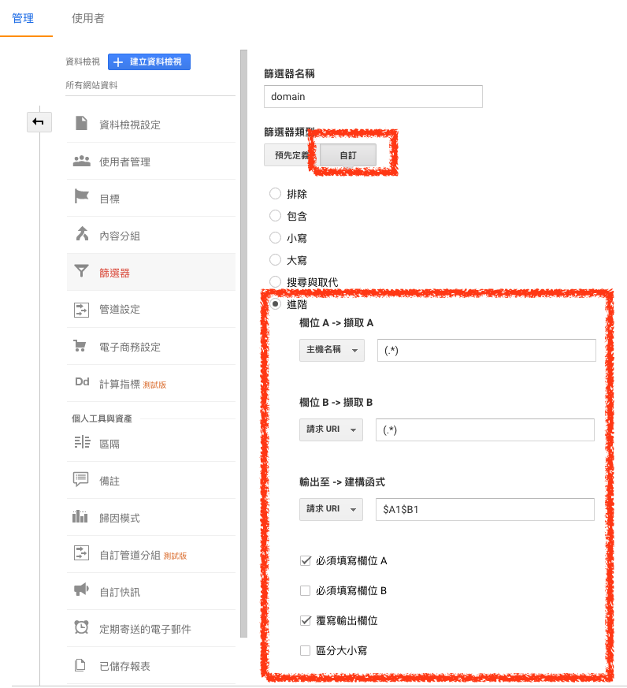

# URI 加入網域

**1. 選擇管理介面篩選器**

> `帳戶` > `資源` > `資料檢視` > `篩選器`

**2. 新增篩選器**

**3. 設定篩選器**

選擇 `自訂` > `進階`

*欄位 A* 選擇 `主機名稱`，並輸入 `(.*)`

*欄位 B* 選擇 `請求 URI`，並輸入 `(.*)`

*輸出至* 選擇 `請求 URI`，並輸入 `$A1$B1`

這樣就可以將 `請求 URI` 加上主機名稱了

